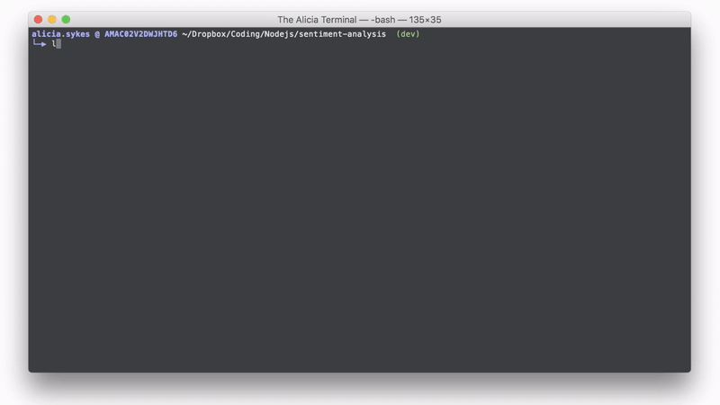

# Minimal Terminal Prompt

[](https://www.codacy.com/app/lissy93/minimal-terminal-prompt?utm_source=github.com&amp;utm_medium=referral&amp;utm_content=Lissy93/minimal-terminal-prompt&amp;utm_campaign=Badge_Grade)

A clean PS1 bash prompt, and corresponding ZSH theme showing: user, host, pathname and dynamic git branch

<p align="center">
  
</p>


## Bash Installation

Clone and cd into the repo, then copy the desired PS1 .sh file contents into your  `~/.bashrc`.
Then just reload your bash profile (either restart your cmd, or run the  source command)

```
git clone https://github.com/Lissy93/minimal-terminal-prompt.git

cd minimal-terminal-prompt

cat minimal-terminal-prompt.sh  >> ~/.bashrc

source ~/.bashrc
```

Done 😎

_**Note, for Mac OS X:** Because by default OS X starts a login session first,
the file `~/.bash_profile` can be used in place of  `~/.bashrc`. Read more about this on this
[GNU Documentation Article](https://www.gnu.org/software/bash/manual/html_node/Bash-Startup-Files.html)._


**References and Further Reading:** All the information you could ever want to know about customising your bash PS1 prompt
can be found on this detailed Linux Documentation and how-to guide, by Giles Orr:
[TLDP: Bash Prompt How-To](http://tldp.org/HOWTO/Bash-Prompt-HOWTO/)


## ZSH Installation

To install this theme for use in [Oh-My-Zsh](https://github.com/robbyrussell/oh-my-zsh),
clone this repository into your OMZ `custom/themes` directory.

```
$ git clone https://github.com/Lissy93/minimal-terminal-prompt.git ~/.oh-my-zsh/custom/themes
```

You then need to select this theme in your ~/.zshrc:

```
ZSH_THEME="minimal-terminal-prompt"
```

Done 😎

For more information, [see this guide about setting ZSH themes](https://github.com/robbyrussell/oh-my-zsh/wiki/Customization#overriding-and-adding-themes).
